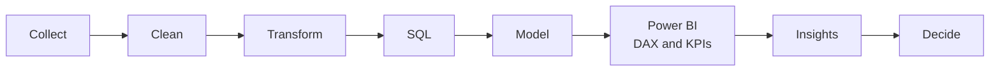

"""
build_profile.py  -  creates a complete 3D animated GitHub profile for Ambati4422
Run:  python build_profile.py
Creates folder  Ambati4422-profile/  containing:
  README.md, assets/*.svg, .github/workflows/*.yml, preview.html
"""
import os

USER = "Ambati4422"
RAW = f"https://raw.githubusercontent.com/{USER}/{USER}/main"
OUT = f"{USER}-profile"
FONT = "'Segoe UI', Helvetica, Arial, sans-serif"

def save(path, text):
    full = os.path.join(OUT, path)
    os.makedirs(os.path.dirname(full), exist_ok=True)
    with open(full, "w", encoding="utf-8") as f:
        f.write(text)
    print("created", full)

# =============================================================== HERO (3D bars)
A, B = 38, 22
DUR = 10
KT = "0;0.14;0.86;0.96;1"
KS = ".2 .8 .2 1;0 0 1 1;.5 0 .8 .2;0 0 1 1"

def shade(h, f):
    r, g, b = int(h[0:2], 16), int(h[2:4], 16), int(h[4:6], 16)
    if f >= 1:
        r, g, b = [int(c + (255 - c) * (f - 1)) for c in (r, g, b)]
    else:
        r, g, b = [int(c * f) for c in (r, g, b)]
    return "#%02x%02x%02x" % (r, g, b)

def P(pts):
    return " ".join("%g,%g" % p for p in pts)

def faces(cx, cy, h):
    top = [(cx, cy - B - h), (cx + A, cy - h), (cx, cy + B - h), (cx - A, cy - h)]
    left = [(cx - A, cy - h), (cx, cy + B - h), (cx, cy + B), (cx - A, cy)]
    right = [(cx, cy + B - h), (cx + A, cy - h), (cx + A, cy), (cx, cy + B)]
    return top, left, right

def cube(cx, cy, size, col, dur, begin):
    a, b, hh = size * .62, size * .36, size * .7
    t = [(cx, cy - b - hh), (cx + a, cy - hh), (cx, cy + b - hh), (cx - a, cy - hh)]
    l = [(cx - a, cy - hh), (cx, cy + b - hh), (cx, cy + b), (cx - a, cy)]
    r = [(cx, cy + b - hh), (cx + a, cy - hh), (cx + a, cy), (cx, cy + b)]
    return (f'<g><animateTransform attributeName="transform" type="translate" values="0 0;0 -12;0 0" dur="{dur}s" begin="{begin}s" repeatCount="indefinite"/>'
            f'<polygon points="{P(t)}" fill="{shade(col, 1.45)}"/><polygon points="{P(l)}" fill="{shade(col, .78)}"/><polygon points="{P(r)}" fill="{shade(col, .5)}"/></g>')

def build_hero():
    heights = [34, 54, 46, 76, 92, 110]
    colors = ["36BCF7", "2DD4BF", "818CF8", "36BCF7", "F2C811", "FB923C"]
    bars = [(590 + 48 * i, 310 - 28 * i, h, c, 0.25 + 0.35 * i)
            for i, (h, c) in enumerate(zip(heights, colors))]
    s = ['<svg xmlns="http://www.w3.org/2000/svg" viewBox="0 0 1000 360" width="1000" height="360" role="img" aria-label="Jagan Ambati - Data Analyst and BI Developer">',
         """<defs>
<linearGradient id="bg" x1="0" y1="0" x2="1" y2="1"><stop offset="0" stop-color="#0b132b"/><stop offset=".55" stop-color="#14213d"/><stop offset="1" stop-color="#0f2027"/></linearGradient>
<radialGradient id="glow" cx=".72" cy=".55" r=".5"><stop offset="0" stop-color="#36BCF7" stop-opacity=".28"/><stop offset="1" stop-color="#36BCF7" stop-opacity="0"/></radialGradient>
<linearGradient id="name" x1="0" y1="0" x2="1" y2="0"><stop offset="0" stop-color="#fff"/><stop offset="1" stop-color="#7fdcff"/></linearGradient>
<linearGradient id="trend" x1="0" y1="1" x2="1" y2="0"><stop offset="0" stop-color="#36BCF7"/><stop offset=".6" stop-color="#F2C811"/><stop offset="1" stop-color="#FB923C"/></linearGradient>
<filter id="blur" x="-20%" y="-20%" width="140%" height="140%"><feGaussianBlur stdDeviation="4"/></filter>
<clipPath id="card"><rect width="1000" height="360" rx="18"/></clipPath>
</defs>
<g clip-path="url(#card)">
<rect width="1000" height="360" fill="url(#bg)"/><rect width="1000" height="360" fill="url(#glow)"/>"""]
    s.append('<g stroke="#7fdcff" stroke-opacity=".07">')
    for x in range(-300, 1100, 228):
        s.append(f'<line x1="{x}" y1="360" x2="{x + 760}" y2="-80"/>')
    for x in range(0, 1500, 228):
        s.append(f'<line x1="{x}" y1="360" x2="{x - 760}" y2="-80"/>')
    s.append("</g>")
    for cx, cy, h, col, delay in reversed(bars):
        full, flat = faces(cx, cy, h), faces(cx, cy, 1.5)
        colr = [shade(col, 1.45), shade(col, .78), shade(col, .5)]
        for i in range(3):
            v = f"{P(flat[i])};{P(full[i])};{P(full[i])};{P(flat[i])};{P(flat[i])}"
            s.append(f'<polygon points="{P(flat[i])}" fill="{colr[i]}"><animate attributeName="points" dur="{DUR}s" begin="{delay:.2f}s" repeatCount="indefinite" calcMode="spline" keyTimes="{KT}" keySplines="{KS}" values="{v}"/></polygon>')
    path = "M 560,246 C 640,196 690,160 760,98 S 835,36 868,24"
    for width, extra in ((10, ' opacity=".5" filter="url(#blur)"'), (3.5, "")):
        s.append(f'<path d="{path}" fill="none" stroke="url(#trend)" stroke-width="{width}" stroke-linecap="round"{extra} stroke-dasharray="620"><animate attributeName="stroke-dashoffset" values="620;0;0;620;620" keyTimes="0;.3;.9;.96;1" dur="{DUR}s" begin="1s" repeatCount="indefinite"/></path>')
    s.append(f'<polygon points="880,18 860,16 866,34" fill="#FB923C"><animate attributeName="opacity" values="0;0;1;1;0;0" keyTimes="0;.28;.32;.9;.96;1" dur="{DUR}s" begin="1s" repeatCount="indefinite"/></polygon>')
    for cx, cy, h, col, delay in bars:
        s.append(f'<circle cx="{cx}" cy="{cy - 2}" r="4.5" fill="#fff"><animate attributeName="cy" dur="{DUR}s" begin="{delay:.2f}s" repeatCount="indefinite" calcMode="spline" keyTimes="{KT}" keySplines="{KS}" values="{cy - 2};{cy - h};{cy - h};{cy - 2};{cy - 2}"/></circle>')
    for args in ((530, 92, 22, "F2C811", 4.2, 0), (935, 300, 18, "36BCF7", 5, 1),
                 (500, 330, 14, "FB923C", 3.6, .5), (955, 110, 14, "2DD4BF", 4.6, 2)):
        s.append(cube(*args))
    s.append(f"""<g font-family="{FONT}">
<g><animate attributeName="opacity" values="0;1" dur="1s" begin=".2s" fill="freeze"/><animateTransform attributeName="transform" type="translate" values="-30 0;0 0" dur="1s" begin=".2s" fill="freeze"/>
<text x="48" y="120" font-size="15" letter-spacing="7" fill="#36BCF7" font-weight="600">HELLO, I'M</text>
<text x="46" y="182" font-size="58" font-weight="800" fill="url(#name)">JAGAN AMBATI</text></g>
<g><animate attributeName="opacity" values="0;1" dur="1s" begin=".7s" fill="freeze"/><animateTransform attributeName="transform" type="translate" values="-30 0;0 0" dur="1s" begin=".7s" fill="freeze"/>
<text x="48" y="226" font-size="25" fill="#e5eefc" font-weight="600">Data Analyst  ·  BI Developer</text>
<text x="48" y="262" font-size="17" fill="#9db4d6">Power BI  •  SQL  •  BigQuery  •  Python</text></g>
<g><animate attributeName="opacity" values="0;1" dur="1s" begin="1.2s" fill="freeze"/>
<rect x="48" y="286" width="268" height="32" rx="16" fill="#36BCF7" fill-opacity=".14" stroke="#36BCF7" stroke-opacity=".6"/>
<circle cx="68" cy="302" r="5" fill="#2DD4BF"><animate attributeName="opacity" values="1;.2;1" dur="1.6s" repeatCount="indefinite"/></circle>
<text x="82" y="307" font-size="14" fill="#d8efff" font-weight="600">Turning data into decisions</text></g>
</g></g>
<rect x=".5" y=".5" width="999" height="359" rx="18" fill="none" stroke="#36BCF7" stroke-opacity=".25"/>
</svg>""")
    return "\n".join(s)

# =============================================================== SKILLS ORBIT
def build_orbit():
    W, H, CX, CY = 900, 300, 450, 150
    rings = [
        dict(rx=335, ry=92, cw=True, dur=30, items=[
            ("Power BI", "F2C811", "111111"), ("SQL", "336791", "ffffff"),
            ("BigQuery", "4285F4", "ffffff"), ("Python", "3776AB", "ffffff"),
            ("Excel", "217346", "ffffff"), ("Tableau", "E97627", "ffffff")]),
        dict(rx=190, ry=52, cw=False, dur=22, items=[
            ("DAX", "F2C811", "111111"), ("Pandas", "7b5cd6", "ffffff"),
            ("NumPy", "4DABCF", "062b3a"), ("Alteryx", "0078C1", "ffffff"),
            ("Power Query", "2DD4BF", "062b3a")]),
    ]
    o = [f'<svg xmlns="http://www.w3.org/2000/svg" viewBox="0 0 {W} {H}" width="{W}" height="{H}" role="img" aria-label="Orbiting skills">',
         """<defs>
<radialGradient id="sphere" cx=".35" cy=".3" r=".8"><stop offset="0" stop-color="#9be7ff"/><stop offset=".45" stop-color="#2a9fd6"/><stop offset="1" stop-color="#0b3a63"/></radialGradient>
<radialGradient id="halo" cx=".5" cy=".5" r=".5"><stop offset="0" stop-color="#36BCF7" stop-opacity=".45"/><stop offset="1" stop-color="#36BCF7" stop-opacity="0"/></radialGradient>
</defs>"""]
    for r in rings:
        o.append(f'<ellipse cx="{CX}" cy="{CY}" rx="{r["rx"]}" ry="{r["ry"]}" fill="none" stroke="#7fdcff" stroke-opacity=".18" stroke-dasharray="4 8"/>')
    o.append(f'<circle cx="{CX}" cy="{CY}" r="60" fill="url(#halo)"/>')
    o.append(f'<circle cx="{CX}" cy="{CY}" r="34" fill="none" stroke="#36BCF7" stroke-width="2"><animate attributeName="r" values="34;56;34" dur="3s" repeatCount="indefinite"/><animate attributeName="stroke-opacity" values=".6;0;.6" dur="3s" repeatCount="indefinite"/></circle>')
    o.append(f'<circle cx="{CX}" cy="{CY}" r="34" fill="url(#sphere)"/>')
    o.append(f'<text x="{CX}" y="{CY + 5}" text-anchor="middle" font-family="{FONT}" font-size="14" font-weight="800" fill="#fff" letter-spacing="2">DATA</text>')
    for r in rings:
        n, dur, rx, ry = len(r["items"]), r["dur"], r["rx"], r["ry"]
        sw = 1 if r["cw"] else 0
        path = f"M {CX - rx},{CY} A {rx},{ry} 0 0,{sw} {CX + rx},{CY} A {rx},{ry} 0 0,{sw} {CX - rx},{CY}"
        if r["cw"]:
            scale, opac = "0.88;0.62;0.88;1.15;0.88", ".85;.5;.85;1;.85"
        else:
            scale, opac = "0.88;1.12;0.88;0.62;0.88", ".85;1;.85;.5;.85"
        for k, (name, bg, fg) in enumerate(r["items"]):
            begin = -(dur * k / n)
            w = len(name) * 8.6 + 28
            o.append(
                f'<g><animateMotion dur="{dur}s" begin="{begin:.2f}s" repeatCount="indefinite" path="{path}"/>'
                f'<g><animateTransform attributeName="transform" type="scale" values="{scale}" keyTimes="0;.25;.5;.75;1" dur="{dur}s" begin="{begin:.2f}s" repeatCount="indefinite"/>'
                f'<animate attributeName="opacity" values="{opac}" keyTimes="0;.25;.5;.75;1" dur="{dur}s" begin="{begin:.2f}s" repeatCount="indefinite"/>'
                f'<rect x="{-w / 2:.1f}" y="-15" width="{w:.1f}" height="30" rx="15" fill="#{bg}" stroke="#ffffff" stroke-opacity=".35"/>'
                f'<text y="5" text-anchor="middle" font-family="{FONT}" font-size="14" font-weight="700" fill="#{fg}">{name}</text></g></g>')
    o.append("</svg>")
    return "\n".join(o)

# =============================================================== DIVIDER
DIVIDER = """<svg xmlns="http://www.w3.org/2000/svg" viewBox="0 0 900 8" width="900" height="8" role="presentation">
<defs>
<linearGradient id="line" x1="0" x2="1"><stop offset="0" stop-color="#36BCF7" stop-opacity="0"/><stop offset=".2" stop-color="#36BCF7"/><stop offset=".5" stop-color="#2DD4BF"/><stop offset=".8" stop-color="#F2C811"/><stop offset="1" stop-color="#FB923C" stop-opacity="0"/></linearGradient>
<linearGradient id="glint" x1="0" x2="1"><stop offset="0" stop-color="#fff" stop-opacity="0"/><stop offset=".5" stop-color="#fff"/><stop offset="1" stop-color="#fff" stop-opacity="0"/></linearGradient>
</defs>
<rect x="0" y="3" width="900" height="2" rx="1" fill="url(#line)"/>
<rect x="-140" y="2" width="140" height="4" rx="2" fill="url(#glint)"><animate attributeName="x" values="-140;900" dur="3.2s" repeatCount="indefinite"/></rect>
</svg>"""

# =============================================================== WORKFLOWS
SNAKE_YML = """name: Generate Snake

on:
  schedule:
    - cron: "0 */12 * * *"
  workflow_dispatch:
  push:
    branches:
      - main

permissions:
  contents: write

jobs:
  generate:
    runs-on: ubuntu-latest
    timeout-minutes: 10
    steps:
      - name: Generate snake SVGs
        uses: Platane/snk/svg-only@v3
        with:
          github_user_name: ${{ github.repository_owner }}
          outputs: |
            dist/github-snake.svg
            dist/github-snake-dark.svg?palette=github-dark

      - name: Push to output branch
        uses: crazy-max/ghaction-github-pages@v4
        with:
          target_branch: output
          build_dir: dist
        env:
          GITHUB_TOKEN: ${{ secrets.GITHUB_TOKEN }}
"""

CONTRIB_YML = """name: GitHub-Profile-3D-Contrib

on:
  schedule:
    - cron: "0 18 * * *"
  workflow_dispatch:

permissions:
  contents: write

jobs:
  build:
    runs-on: ubuntu-latest
    name: Generate 3D contribution graph
    steps:
      - uses: actions/checkout@v4

      - uses: yoshi389111/github-profile-3d-contrib@0.7.1
        env:
          GITHUB_TOKEN: ${{ secrets.GITHUB_TOKEN }}
          USERNAME: ${{ github.repository_owner }}

      - name: Commit and push
        run: |
          git config user.name "github-actions[bot]"
          git config user.email "41898282+github-actions[bot]@users.noreply.github.com"
          git add -A .
          git commit -m "chore: update 3D contribution graph" || exit 0
          git push
"""

# =============================================================== README
README = """

  

## ⚡ Recruiter Quick-Scan

<table>
  <tr><td><b>🎯 Role</b></td><td>Junior Software Engineer · Data Analytics &amp; Business Intelligence</td></tr>
  <tr><td><b>🏢 Currently</b></td><td>iLogitek Business Solutions, Bengaluru</td></tr>
  <tr><td><b>🧰 Core stack</b></td><td>Power BI (DAX, Power Query) · SQL · BigQuery · Python (Pandas, NumPy) · Excel · Tableau · Alteryx</td></tr>
  <tr><td><b>💪 Strengths</b></td><td>Data validation &amp; QA · dashboard design · KPI development · stakeholder reporting</td></tr>
  <tr><td><b>🎓 Education</b></td><td>B.Tech, Electronics &amp; Communication Engineering (2025)</td></tr>
  <tr><td><b>📬 Contact</b></td><td><a href="mailto:ambatijaganreddyj@gmail.com">Email</a> · <a href="https://www.linkedin.com/in/ambati-jagan2002/">LinkedIn</a> · <a href="https://thriving-dragon-b028c4.netlify.app">Portfolio</a></td></tr>
</table>

## 🧊 My GitHub in 3D

## 🪐 Skills Orbit

## 🔄 How I Work

## 🚀 Featured Projects

<table>
  <tr>
    <td width="50%" valign="top">
      <h3>🇮🇳 Digital India Performance Dashboard</h3>
      <b>Excel · Power BI · DAX</b>  
      Cleaned digital performance data, built KPI tracking and interactive dashboards on internet usage and digital adoption.
    </td>
    <td width="50%" valign="top">
      <h3>🏢 HRMS Market Analysis</h3>
      <b>Excel · SQL · Power BI</b>  
      Researched HRMS/HCM vendors, compared categories, pricing and product offerings in a competitive market dashboard.
    </td>
  </tr>
  <tr>
    <td width="50%" valign="top">
      <h3>📱 Mobile Accessories Demand Analysis</h3>
      <b>Excel · Power BI</b>  
      Identified high and low performing products and markets, compared shop-level sales and studied profitability.
    </td>
    <td width="50%" valign="top">
      <h3>🏨 Hotel Management Analytics</h3>
      <b>Python · SQL · Power BI</b>  
      Cleaned hotel data with Python, queried with SQL and delivered interactive dashboards with business insights.
    </td>
  </tr>
  <tr>
    <td width="50%" valign="top">
      <h3><a href="https://github.com/Ambati4422/Salesman-performance-dashboard-excel-">📈 Salesman Performance Dashboard</a></h3>
      <b>Excel</b>  
      Sales trends, target achievement, revenue, customer acquisition and regional performance.
    </td>
    <td width="50%" valign="top">
      <h3><a href="https://github.com/Ambati4422/Dax-visualization-in-power-bi">📊 DAX Sales Visualization</a></h3>
      <b>Power BI · DAX</b>  
      Sales performance dashboard covering trends, target achievement and geographic distribution by city.
    </td>
  </tr>
</table>

## 📊 GitHub Stats

## 🎯 Currently Learning

`Advanced DAX` · `Advanced SQL` · `BigQuery` · `Python for Analytics` · `Data Modeling` · `Data Storytelling`

## 🐍 Contribution Snake

<picture>
  <source media="(prefers-color-scheme: dark)" srcset="https://raw.githubusercontent.com/Ambati4422/Ambati4422/output/github-snake-dark.svg"/>
  <source media="(prefers-color-scheme: light)" srcset="https://raw.githubusercontent.com/Ambati4422/Ambati4422/output/github-snake.svg"/>
  
</picture>

 

<i>"Turning data into insights, one dashboard at a time." 📊</i>

""".replace("{RAW}", RAW)

# =============================================================== LOCAL PREVIEW
PREVIEW = """<!doctype html><html><head><meta charset="utf-8"><title>Preview</title>
</head>
<body><h2>Local preview (open this file in Chrome)</h2>

If you can see and watch these animate here, they will work on GitHub once uploaded.
</body></html>"""

# =============================================================== RUN
save("assets/hero-3d.svg", build_hero())
save("assets/skills-orbit.svg", build_orbit())
save("assets/divider.svg", DIVIDER)
save(".github/workflows/snake.yml", SNAKE_YML)
save(".github/workflows/profile-3d.yml", CONTRIB_YML)
save("README.md", README)
save("preview.html", PREVIEW)
print("\nDONE -> open", os.path.join(OUT, "preview.html"), "in Chrome, then upload the folder contents to your repo.")
