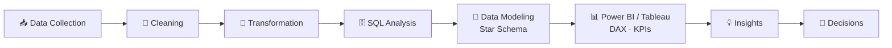

 

---

## 👋 About Me

I turn **raw data into clear business insights**. I work at **iLogitek Business Solutions (Bengaluru)**, where I focus on data validation, dashboards and stakeholder reporting.

- 📊 Building interactive dashboards with **Power BI** and **Tableau**
- 🗄️ Writing **SQL / BigQuery** for extraction, transformation and analysis
- 🐍 Using **Python (Pandas, NumPy)** for cleaning and exploration
- ✅ Care about data quality: validation, QA and reconciliation before anything reaches a report
- 🎓 B.Tech in Electronics & Communication Engineering (2025)

---

## 🧊 My GitHub in 3D

---

## 🛠️ Tech Stack

**Business Intelligence**

**Databases & Cloud**

**Python for Data**

---

## 🔄 How I Work

---

## 🚀 Featured Projects

<table>
  <tr>
    <td width="50%" valign="top">
      <h3>🇮🇳 Digital India Performance Dashboard</h3>
      <b>Excel · Power BI · DAX</b>  
      Cleaned digital performance data, built KPI tracking and interactive dashboards on internet usage and digital adoption.
    </td>
    <td width="50%" valign="top">
      <h3>🏢 HRMS Market Analysis</h3>
      <b>Excel · SQL · Power BI</b>  
      Researched HRMS/HCM vendors, compared categories, pricing and product offerings in a competitive market dashboard.
    </td>
  </tr>
  <tr>
    <td width="50%" valign="top">
      <h3>📱 Mobile Accessories Demand Analysis</h3>
      <b>Excel · Power BI</b>  
      Identified high and low performing products and markets, compared shop-level sales and studied profitability.
    </td>
    <td width="50%" valign="top">
      <h3>🏨 Hotel Management Analytics</h3>
      <b>Python · SQL · Power BI</b>  
      Cleaned hotel data with Python, queried with SQL and delivered interactive dashboards with business insights.
    </td>
  </tr>
  <tr>
    <td width="50%" valign="top">
      <h3><a href="https://github.com/Ambati4422/Salesman-performance-dashboard-excel-">📈 Salesman Performance Dashboard</a></h3>
      <b>Excel</b>  
      Sales trends, target achievement, revenue, customer acquisition and regional performance.
    </td>
    <td width="50%" valign="top">
      <h3><a href="https://github.com/Ambati4422/Dax-visualization-in-power-bi">📊 DAX Sales Visualization</a></h3>
      <b>Power BI · DAX</b>  
      Sales performance dashboard covering trends, target achievement and geographic distribution by city.
    </td>
  </tr>
</table>

---

## 📊 GitHub Stats

---

## 🎯 Currently Learning

`Advanced DAX` · `Advanced SQL` · `BigQuery` · `Python for Analytics` · `Data Modeling` · `Data Storytelling`

---

## 🐍 Contribution Snake

<picture>
  <source media="(prefers-color-scheme: dark)" srcset="https://raw.githubusercontent.com/Ambati4422/Ambati4422/output/github-snake-dark.svg"/>
  <source media="(prefers-color-scheme: light)" srcset="https://raw.githubusercontent.com/Ambati4422/Ambati4422/output/github-snake.svg"/>
  
</picture>

 

<i>"Turning data into insights, one dashboard at a time." 📊</i>

name: Generate Snake

on:
  schedule:
    - cron: "0 */12 * * *"
  workflow_dispatch:
  push:
    branches:
      - main

permissions:
  contents: write

jobs:
  generate:
    runs-on: ubuntu-latest
    timeout-minutes: 10

    steps:
      - name: Generate snake SVGs
        uses: Platane/snk/svg-only@v3
        with:
          github_user_name: ${{ github.repository_owner }}
          outputs: |
            dist/github-snake.svg
            dist/github-snake-dark.svg?palette=github-dark

      - name: Push to output branch
        uses: crazy-max/ghaction-github-pages@v4
        with:
          target_branch: output
          build_dir: dist
        env:
          GITHUB_TOKEN: ${{ secrets.GITHUB_TOKEN }}

          
name: GitHub-Profile-3D-Contrib

on:
  schedule:
    - cron: "0 18 * * *"
  workflow_dispatch:

permissions:
  contents: write

jobs:
  build:
    runs-on: ubuntu-latest
    name: Generate 3D contribution graph

    steps:
      - uses: actions/checkout@v4

      - uses: yoshi389111/github-profile-3d-contrib@0.7.1
        env:
          GITHUB_TOKEN: ${{ secrets.GITHUB_TOKEN }}
          USERNAME: ${{ github.repository_owner }}

      - name: Commit and push
        run: |
          git config user.name "github-actions[bot]"
          git config user.email "41898282+github-actions[bot]@users.noreply.github.com"
          git add -A .
          git commit -m "chore: update 3D contribution graph" || exit 0
          git push
